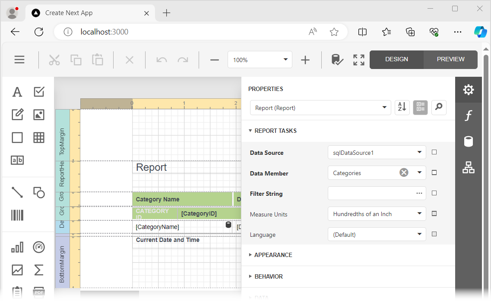

<!-- default badges list -->

[](https://docs.devexpress.com/GeneralInformation/403183)
[](#does-this-example-address-your-development-requirementsobjectives)
<!-- default badges end -->
# Reporting for React - Customize a Web Report Designer to a React App (Next.js)

This example incorporates the Web Report Designer into a client-side app built with React. The example consists of two parts:

- The [ServerSideApp](ServerSideApp) folder contains the backend project. The project is an ASP.NET Core application that enables [cross-domain requests (CORS)](https://developer.mozilla.org/en-US/docs/Web/HTTP/CORS) (Access-Control-Allow-Origin) and implements custom web report storage.


- The [react-report-designer](react-report-designer) folder contains the client application built with React.

This project contains code snippets used for client-side customization and reflected in our online help topics. Each code snippet is enclosed in a `page.tsx` file in a separate folder. After running the project, navigate the following locations to see the result:

| Location | Description |
| --- | --- |
| /client-side-api | Performs some client-side actions.
| /save-modified-report | Saves a modified report in the currently active tab. Saves all modified reports. | 
| /manage-properties-panel | Hides or disables individual editors or sections in the **Properties panel** for the specified control type. |
| /report-designer-api | Calls the Report Designer's `RunWizard` method to invoke New Report Wizard. |
| /open-report | Adds a button that loads a specified report. |
| /save-report | Adds a button that saves the current report. |


## Quick Start

### Server

In the *ServerSideApp/ServerSideApp* folder, run the following command:


```
dotnet run
```

The server starts at http://localhost:5000. To debug the server, run the application in Visual Studio.

### Client

In the *react-report-designer* folder, run the following commands:

```
npm install
npm run dev
```

Open `http://localhost:3000/` in your browser to view the result. The application displays the Web Report Designer.




## Files to Review

- [page.tsx](react-report-designer/app/page.tsx)
- [Program.cs](ServerSideApp/ServerSideApp/Program.cs)
- [ReportingControllers.cs](ServerSideApp/ServerSideApp/Controllers/ReportingControllers.cs)

## Documentation

- [Create a React Application with Web Report Designer](https://docs.devexpress.com/XtraReports/119339)
- [Report Designer Server-Side Configuration (ASP.NET Core)](https://docs.devexpress.com/XtraReports/400196)

## More Examples

* [Reporting for React - Integrate Document Viewer in React App](https://github.com/DevExpress-Examples/reporting-react-integrate-web-document-viewer)


<!-- feedback -->
## Does this example address your development requirements/objectives?

[](https://www.devexpress.com/support/examples/survey.xml?utm_source=github&utm_campaign=reporting-react-end-user-designer-customizations&~~~was_helpful=yes) [](https://www.devexpress.com/support/examples/survey.xml?utm_source=github&utm_campaign=reporting-react-end-user-designer-customizations&~~~was_helpful=no)

(you will be redirected to DevExpress.com to submit your response)
<!-- feedback end -->
